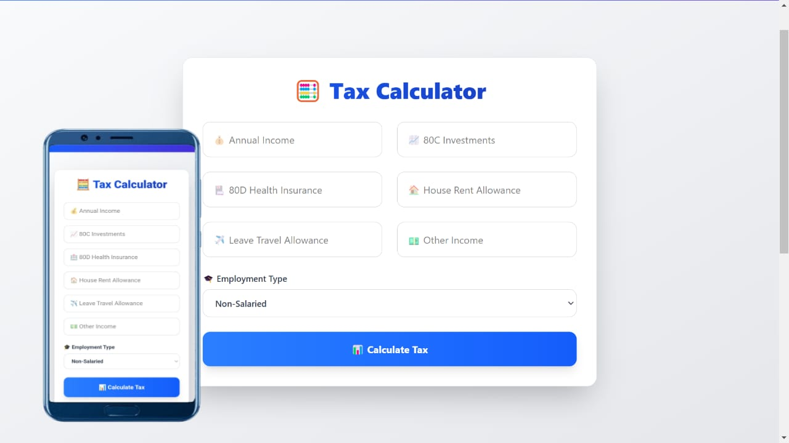
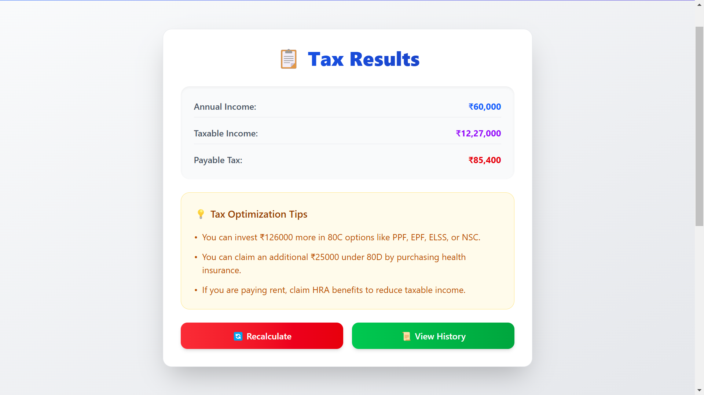
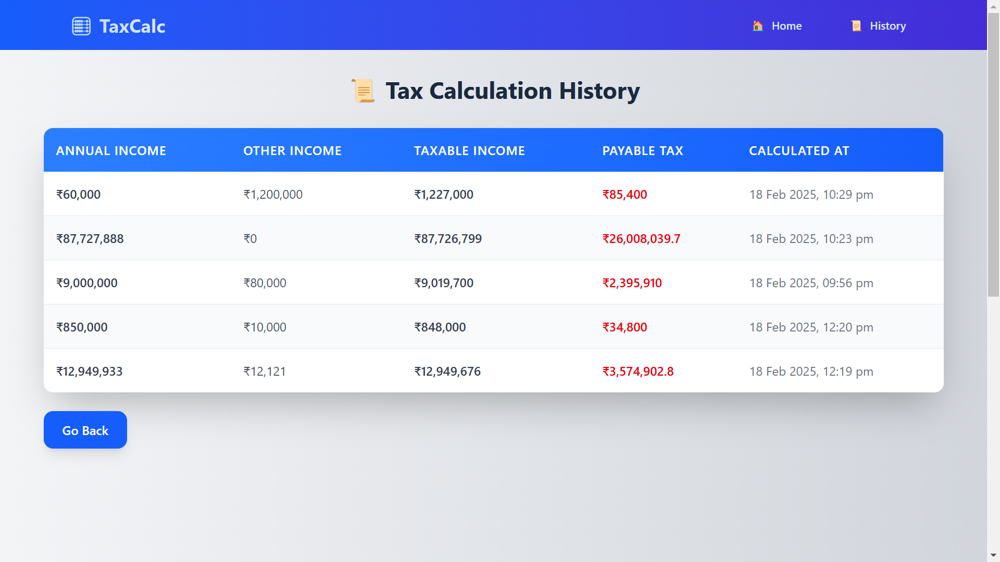

# Tax Calculation Web App 





## Live Demo

🔗 [Hosted Live Link](https://taxcalfrontend.onrender.com/)

## Overview

This web application allows users to calculate their income tax based on various parameters such as income, investments, and deductions. The application features a clean, modern UI built using **React** (with Vite) and **Tailwind CSS** for styling, while the backend is powered by **Node.js**, **Express**, and **MongoDB** to handle data storage and tax calculation operations.

## Features

- 📊 **Tax Calculation**: Users can input details like annual income, investments, and other deductions to calculate their tax liability.
- 🧾 **Tax History**: Users can view their previous tax calculation history, including details such as income, deductions, tax payable, and calculation date.
- 💡 **Suggestions**: The app provides useful suggestions on how to optimize tax-saving investments.
- 📱 **Responsive Design**: Optimized for mobile and desktop devices, ensuring a seamless experience across platforms.

## Tech Stack

- **Frontend**:
  - React (Vite) 🚀
  - Tailwind CSS 🎨
  - React Router DOM 🌐 (for routing)
 

- **Backend**:
  - Node.js ⚙️
  - Express.js 🖥️
  - MongoDB (Mongoose for ORM) 📚
  - Axios 🌍 (for API calls)
  - dotenv 🌿 (for environment variables)

## Installation

### Frontend Setup

1. Clone the repository:
   ```bash
   git clone https://github.com/Afzal-Mia/tax-calculation-app.git
  
2. .env file  
```bash   
PORT=5000
MONGO_URI=your_mongodb_connection_string
